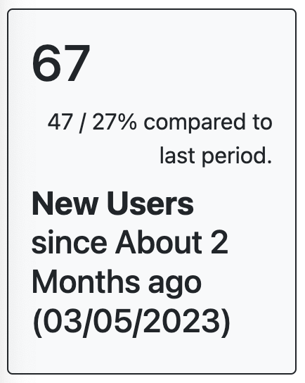

# Color Schemes

## Available Colors

- [Neutral](#neutral) _(default)_
- [Blue](#blue)

### Neutral _(default)_



```ruby
<%= render Matey::[ComponentType].new(..., color_scheme: 'neutral') %>
```

Note: If `color_scheme` argument is omitted, color scheme value defaults to `neutral`

### Blue


```ruby
<%= render Matey::[ComponentType].new(..., color_scheme: 'blue') %>
```
