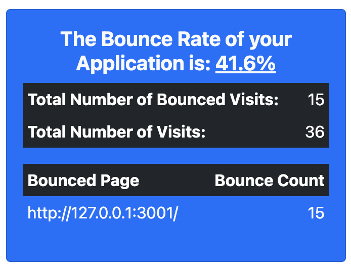

# Components

The following components are available;

* [NewUsersComponent](#newuserscomponent)
* [ActiveUsersComponent](#activeuserscomponent)
* [NewActivityComponent](#newactivitycomponent)
* [TopVisitedLandingPagesComponent](#topvisitedlandingpagescomponent)
* [TopEventsComponent](#topeventscomponent)
* [BounceRateComponent](#bounceratecomponent)

## NewUsersComponent


The NewUsersComponent displays the number of new users that have been created within the time window parameter. It also displays the number and percentage change from the previous time period. 

``` ruby
<%= render Matey::NewUsersComponent.new(users: User.all, time_window: 2.month) %>
```

Here we are passing in all of our **User** model data for the component to find the new users that were made in the last 2 months, but we can filter this data to only include a specific subset of users and/or a specific time period. The component finds new users created in the past month and shows us the increase/decrease since the last period based on the `created_at` attribute.

## ActiveUsersComponent


The ActiveUsersComponent displays the number of active users that have been created within the time window parameter.  It also displays the number and percentage change from the previous time period. This component counts active users as those who have been involved in an Ahoy event in the given time window.

``` ruby
<%= render Matey::ActiveUsersComponent.new(events: Ahoy::Event.all, time_window: 1.month) %>
```

Here we are passing in all of our **Ahoy::Event** model data which is used to determine what users triggered an event in the parameter time period. The component finds the active users created in the past month and shows us the increase/decrease since the last period.

## NewActivityComponent


The NewActivityComponent component displays the number of Ahoy events that have been created within the time window parameter. It also displays the number and percentage change from the previous time period.

``` ruby
<%= render (Matey::NewActivityComponent.new(events: Ahoy::Event.all, time_window: 1.month)) %>
```

Here we are passing in all of our **Ahoy::Event** model data for the component to count all Ahoy Events, but we can filter this data to only include a specific subset of Ahoy Events or from a specific time period. The component finds the Ahoy events created in the past month and shows us the increase/decrease since the last period.

## TopVisitedLandingPagesComponent


The TopVisitedPagesTableComponent component uses **`Ahoy::Visit`** data and displays a list of the top visited paths. Pass in `Ahoy::Visit.all` and the component displays the top landing pages based on the visits that have been created within the time window parameter. The *`limit`* parameter limits the number of results and is `10` by default. 

``` ruby
<%= render Matey::TopVisitedPagesTableComponent.new(events: Ahoy::Visit.all, time_window: 1.month, limit: 10) %>
```

## TopEventsComponent


The TopEventsComponent displays a list of the top Ahoy::Events. Pass in the `Ahoy::Event.all` and the component calculates the top events that have been triggered in the given time window. The *`limit`* parameter limits the number of results and is `10` by default.

``` ruby
<%= render(Matey::TopEventsComponent.new(events: Ahoy::Event.all, time_window: 1.month, limit: 10)) %>
```

## BounceRateComponent


The BounceRateComponent displays the total bounce rate percentage of the application. That is the number of visits to the application in which the user visited **only** one page and left the site, compared to the total number of visits to the application. It additionally shows a list of the pages with the highest bounces. Pass in the `Ahoy::Event.all` & `Ahoy::Visit.all` parameters and the component calculates the bounce rate of the application and the top 5 pages with the highest bounces. The *`limit`* parameter limits the number of results and is `5` by default.

``` ruby
<%= render(Matey::BounceRateComponent.new(events: Ahoy::Event.all, visits: Ahoy::Visit.all, limit: 5)) %>
```
