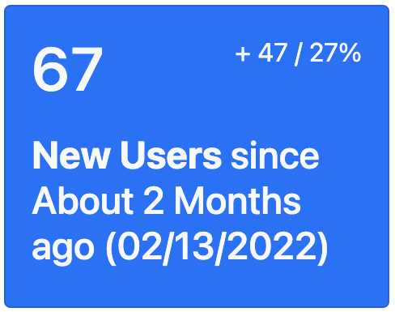
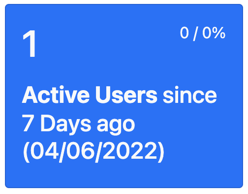
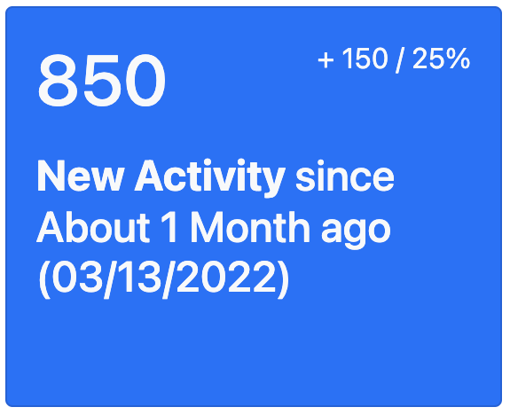
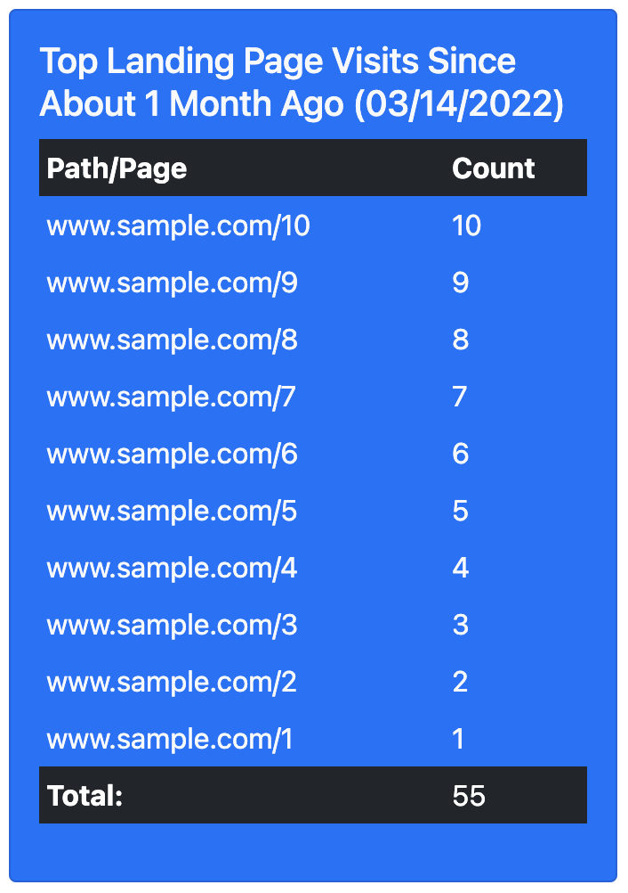
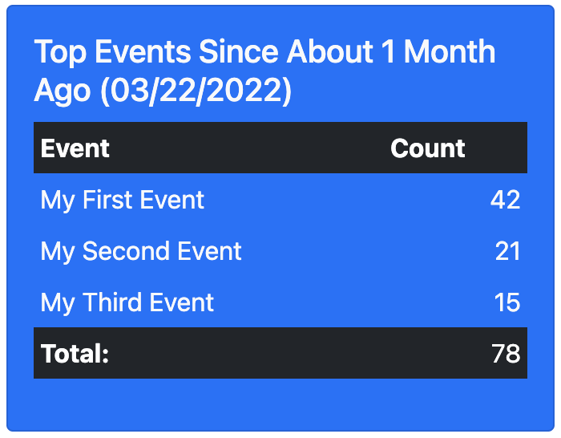

# Matey

 
 


📈 User Engagement Tracking Components for your Ahoy data 🏴‍☠️

This gem provides a suite of *ViewComponents* to observe user engagement in your Ahoy-powered Ruby on Rails application.

In order to use this gem you must:
* Have [Ahoy](https://github.com/ankane/ahoy) installed, configured and actively tracking user visit and event data
* Have [Bootstrap 5.1](https://getbootstrap.com/docs/5.1/getting-started/introduction/) available for styling

## Installation

Add this line to your application's Gemfile:

```ruby
# latest from rubygems
gem 'matey'

# latest from github
gem 'matey', github: 'harled/matey', branch: 'main'
```

And then execute:

    $ bundle install

You now have the latest version of *Matey*. Checkout the [Usage](#usage) section to see what components this gem includes and how to use them in your application.

## Usage

This section outlines the components Matey offers and how to use them 🛠️

### Basics

Below are some common flows that will help you recognize how the named parameters work for *Matey*'s components. 

All of the Matey components follow the same pattern. The following is an example of calling the `ActiveUsersComponent` to report on the last week of data based on all Ahoy events.

This is what rendering a *Matey* view component would look like in your view file:


```ruby
# dashboard.html.erb
<%= render Matey::ActiveUsersComponent.new(events: Ahoy::Event.all, time_window: 1.week) %>
```

All components begin with **`Matey::`** followed by the name of the component. The **`data`** parameter varies but will always expect the parameter to be an ***ActiveRecordRelation*** collection. 

The **`time_window`** parameter is the time range that you want your data filtered based on. This is an optional parameter. The default is a `1.week` time window.

**Note**: The more data you have, the more interesting the components will be. A common and helpful pattern is to capture events on all controller actions. Details on doing this can be found [here](https://github.com/ankane/ahoy#ruby).

If you have a lot of visit/event data, you can always control the load time of components by reducing the `time_window` parameter (i.e. using a range of a year could be a lot of data!).

## Components

The following components are available;

* [NewUsersComponent](#newuserscomponent)
* [ActiveUsersComponent](#activeuserscomponent)
* [NewActivityComponent](#newactivitycomponent)
* [TopVisitedLandingPagesComponent](#topvisitedlandingpagescomponent)
* [TopEventsComponent](#topeventscomponent)
* [CustomCardComponent](#customcardcomponent)
* [CustomTableComponent](#customtablecomponent)

### NewUsersComponent



The NewUsersComponent displays the number of new users that have been created within the time window parameter. It also displays the number and percentage change from the previous time period. 

``` ruby
<%= render Matey::NewUsersComponent.new(users: User.all, time_window: 2.month) %>
```

Here we are passing in all of our **User** model data for the component to find the new users that were made in the last 2 months, but we can filter this data to only include a specific subset of users and/or a specific time period. The component finds new users created in the past month and shows us the increase/decrease since the last period based on the `created_at` attribute.

### ActiveUsersComponent



The ActiveUsersComponent displays the number of active users that have been created within the time window parameter.  It also displays the number and percentage change from the previous time period. This component counts active users as those who have been involved in an Ahoy event in the given time window.

``` ruby
<%= render Matey::ActiveUsersComponent.new(events: Ahoy::Event.all, time_window: 1.month) %>
```

Here we are passing in all of our **Ahoy::Event** model data which is used to determine what users triggered an event in the parameter time period. The component finds the active users created in the past month and shows us the increase/decrease since the last period.

### NewActivityComponent



The NewActivityComponent component displays the number of Ahoy events that have been created within the time window parameter. It also displays the number and percentage change from the previous time period.

``` ruby
<%= render (Matey::NewActivityComponent.new(events: Ahoy::Event.all, time_window: 1.month)) %>
```

Here we are passing in all of our **Ahoy::Event** model data for the component to count all Ahoy Events, but we can filter this data to only include a specific subset of Ahoy Events or from a specific time period. The component finds the Ahoy events created in the past month and shows us the increase/decrease since the last period.

### TopVisitedLandingPagesComponent



The TopVisitedPagesTableComponent component uses **`Ahoy::Visit`** data and displays a list of the top visited paths. Pass in `Ahoy::Visit.all` and the component displays the top landing pages based on the visits that have been created within the time window parameter. The *`limit`* parameter limits the number of results and is `10` by default. 

``` ruby
<%= render Matey::TopVisitedPagesTableComponent.new(events: Ahoy::Visit.all, time_window: 1.month, limit: 10) %>
```

### TopEventsComponent



The TopEventsComponent displays a list of the top Ahoy::Events. Pass in the `Ahoy::Event.all` and the component calculates the top events that have been triggered in the given time window. The *`limit`* parameter limits the number of results and is `10` by default.

``` ruby
<%= render(Matey::TopEventsComponent.new(events: Ahoy::Event.all, time_window: 1.month, limit: 10)) %>
```

### CustomCardComponent
*`Coming Soon...`*

### CustomTableComponent
*`Coming Soon...`*

## Development

After checking out the repo, run `bin/setup` to install dependencies. Then, run `rake spec` to run the tests. You can also run `bin/console` for an interactive prompt that will allow you to experiment.

To install this gem onto your local machine, run `bundle exec rake install`.

A sample application is included in this repository to help with exploring the components and testing. To use the 
sample application: 

1. `cd spec/sample`
2. `bundle`
3. `rails s`
4. Open a browser to `localhost:3000`


<br>

#### Releasing a New Version
To release a new version, update the version number in `version.rb`, and then run `bundle exec rake release`, which will create a git tag for the version, push git commits and the created tag, and push the `.gem` file to [rubygems.org](https://rubygems.org).


## Testing

Use the following steps to run the test cases:

1. `rails db:test:prepare`
2. `bundle exec rake`

## Contributing

Please take a look at our [Contribution Guidelines](https://github.com/harled/matey/blob/main/docs/CONTRIBUTING.md).


## License

The gem is available as open source under the terms of the [MIT License](https://opensource.org/licenses/MIT).

## Code of Conduct

Everyone interacting in the *Matey* project's codebases, issue trackers, chat rooms and mailing lists is expected to follow the [code of conduct](https://github.com/harled/matey/blob/master/CODE_OF_CONDUCT.md).

Project Lead: __Caitlin Henry__ <br>([**caitmich**](https://github.com/caitmich) | caitlin@harled.ca)
